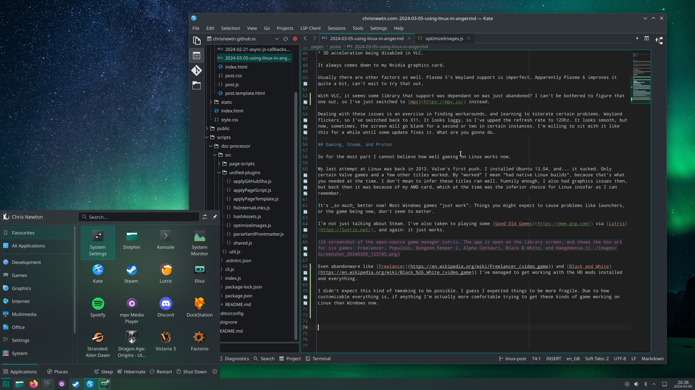
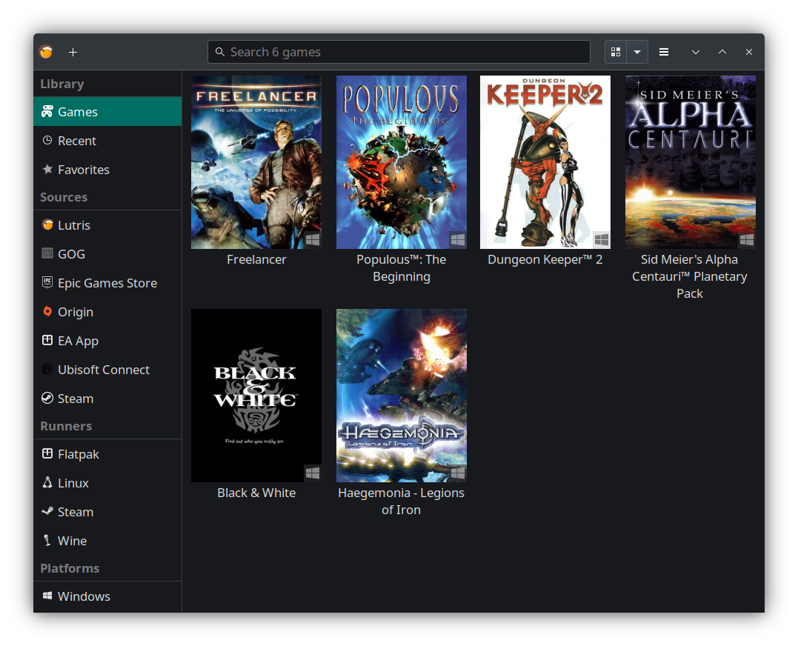

# Using Linux in Anger

Two years ago, I uninstalled Windows. Since then I've been using Linux on and off as my daily driver. There are things I love, and things I find quite annoying. Here we go.

## Why I switched

My computer's old. It's old and incompatible with Windows 11. Why does that matter? Well, at some point my PC started doing "Windows 11 compatibility checks" on every boot, which would 100% the CPU and take about half an hour. The result every time, given no hardware had changed whatsoever, was the same. Incompatible. It got really annoying.

At the time my work had provided me with a PC that was superior in spec in every way to mine, so that became my daily driver instead. Installing Linux started to seem like a very low stakes option for my old PC. If I messed up the installation or broke my machine in some way, I didn't really mind anymore.

## Which distro did I pick?

I chose [Manjaro](https://manjaro.org/). The Steam Deck had just been released some months before, and I was aware of two things:

* Steam OS is now [Arch](https://archlinux.org/about/) based.
* It uses [KDE Plasma](https://kde.org/plasma-desktop/) for its "desktop mode".

At the time I wasn't sure if I wanted a Deck, but I did feel like tinkering. Using the same tools felt like a good way to take advantage of [the money Valve was surely spending in the space](https://youtu.be/El5VfjHQm5E?t=662 "A talk by David Edmundson at Akademy 2022 where he mentions himself and others being contracted by Valve to improve specific parts of Plasma."), and the new attention.  Also, this was transferrable knowledge if I ever got a Deck (I eventually did).

But why Manjaro? Well, I suppose there isn't much to it, really.

* There's a Plasma release.
* It's Arch based.
* [It is green](https://youtu.be/s6k_9qZtzjY).

So it ticks the Steam OS boxes and it looks cool. I wish I could say there's more, but what can I say! I'm a Linux amateur! I'm sure more experienced fans could reel off better reasons, but these are basically mine.

## Nvidia

My Linux experience has varied, and it does seem to be improving on the whole. Here's the main problem: I have an Nvidia graphics card. Whenever I experience a problem, whether it's:

* [Wayland](https://wayland.freedesktop.org/) not working.
* the screen flickering.
* the screen going blank for a second or two in certain instances.
* 3D acceleration being disabled in VLC.

It always comes down to my Nvidia graphics card.

Usually there are other factors as well. Plasma 5's Wayland support is imperfect. Apparently Plasma 6 improves it quite a bit, can't wait to try that out.

With VLC, it seems some library that support was dependant on was just abandoned? I can't be bothered to figure that one out, so I've just switched to [mpv](https://mpv.io/) instead.

Dealing with these issues is an exercise in finding workarounds, and learning to tolerate certain problems. Wayland flickers, so I've switched back to X11. It looks laggy, so I've upped the refresh rate to 120hz. It looks smooth, but now, sometimes, the screen will go blank for a second or two in certain instances. I'm willing to sit with it like this for a while until some update fixes it. What are you gonna do.

## Gaming, Steam, and Proton

So for the most part I cannot believe how well gaming on Linux works now.

My last attempt at Linux was back in 2013. Valve's first push. I installed Ubuntu 13.04, and... it sucked. Only certain Valve games and a few other titles worked. By "worked" I mean "had native Linux builds", because that's what you needed at the time. I don't mean to infer these titles ran well. Funnily enough, I also had graphics issues then, but back then it was because of my AMD card, which at the time was the inferior choice for Linux insofar as I can remember.

It's _so much_ better now! Most Windows games I've tried "just work". Things you might expect to cause problems like launchers, or the game being new, don't seem to matter.

I'm not just talking about Steam. I've also taken to playing some [Good Old Games](https://www.gog.com/) via [Lutris](https://lutris.net/), and again: it just works.

Even abandonware like [Freelancer](https://en.wikipedia.org/wiki/Freelancer_(video_game)) and [Black and White](https://en.wikipedia.org/wiki/Black_%26_White_(video_game)) I've managed to get working with the HD mods installed and everything.

I didn't expect this kind of tweaking to be possible. I guess I expected things to be more fragile. Due to how customizable everything is, if anything I'm actually _more_ comfortable trying to get these kinds of game working on Linux than Windows now.

## Conclusion

So, how's the basic stuff like listening to Spotify, scrolling Twitter, chatting through Discord, and so on? All basically fine. I could go on about figuring out [Flatpaks](https://flatpak.org/), and [Snaps](https://snapcraft.io/about) and the like, but this is already a long post.

On the whole, I'm happy. I get a good shell out of the box unlike Windows, good games support unlike MacOS, and a system package manager unlike both.

For now, I'm sticking with Linux. I'm even considering using it when I eventually upgrade this bucket.

In Windows 10 & 11, Microsoft show ads in the form of "tips, tricks and suggestions", and drop apps you've never used before onto the start menu and shit, and it's like: no. Just no. Absolutely the fuck not. And now they're replacing the meta key with an ["AI key"](https://www.bbc.co.uk/news/technology-67881373)? Who wants this crap?

Assuming Nvidia eventually resolve their driver issues, I'm sticking with Linux for the long haul. You know, until some new "triple A" game comes out that I desperately want to play and doesn't work on Linux. In which case I will fold instantly.
