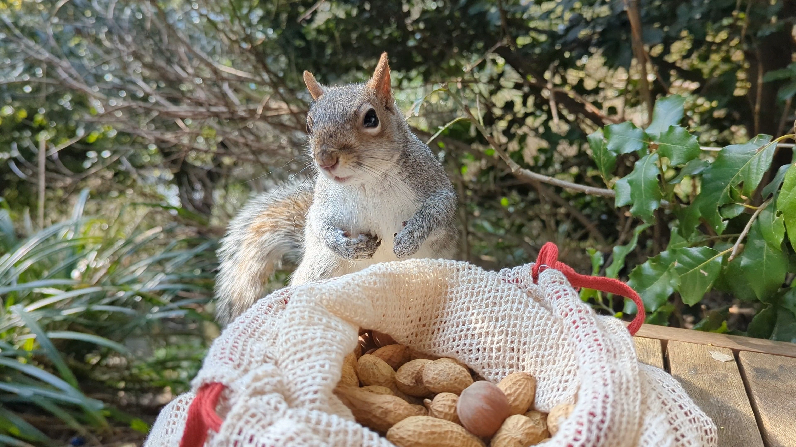

# Image Captions and Markdown

In my [last blog post](./2024-03-05-using-linux-in-anger.md) I posted a few images. I wanted to caption these with a bit of whimsey, but Markdown has no explict way of captioning images.

Without control over the Markdown to HTML pipeline, you have to resort to inline HTML. Not ideal. Luckily, with [Unified.js](https://unifiedjs.com/), you can control the pipline.

## Markdown image attributes

The [CommonMark specification](https://spec.commonmark.org/0.31.2/#example-573) allows you to set two Attributes on the image: `alt` and `title`.

The [`alt`](https://developer.mozilla.org/en-US/docs/Web/API/HTMLImageElement/alt) attribute, in this case, should be used to describe the image in the article in an accessible way. If the image is a screenshot, for example, the `alt` attribute should describe what it is a screenshot of.

The `title` attribute, however, is a global attribute with no specific guidance for images. In fact, using it to describe an image [could be considered harmful](https://developer.mozilla.org/en-US/docs/Web/HTML/Global_attributes/title#accessibility_concerns) from an accessibility standpoint. It's all Markdown provides however, so here's how to use it to describe an image in an accessible way.

## Transforming the image title to a caption

Each blog post on this site is transformed using a [Unified.js pipeline](https://github.com/chrisnewtn/chrisnewtn.github.io/blob/394210b8e84f675eac0777850fb83e78d85b082a/scripts/doc-processor/index.js). This pipeline is processed in a linear way:

1. Parse the text of a Markdown file into an Abstract Syntax Tree (AST).
2. Transform the Markdown AST into an HTML AST.
3. Turn the HTML AST into string.

The place to add this "Title to Caption" transform is between steps 2 and 3.

### An empty Unified.js plugin

```js
/**
 * @type {import('unified').Plugin<[], import('hast').Root>}
 */
export default function imageTitlesToCaptions() {
  return tree => {
    // where the business will happen
  }
}
```

This is the basic signature of a Unified.js plugin. It's function that returns a function. The outer function can accept config. The inner functions accepts the [HAST](https://github.com/syntax-tree/hast) tree which represents the article.

The `@type` comment is [a JSDoc tag](https://jsdoc.app/tags-type) that provides some nice auto-predict support in text editors like [VSCode](https://code.visualstudio.com/).

### Finding all images with titles

```js
// Select all images with titles.
for (const imgEl of selectAll('img[title]', tree)) {
  // Get the image's title property if it has one.
  const title = imgEl.properties.title;

  // Ignore images with empty title properties.
  if (!title) {
    continue;
  }

  // More business in a moment
}
```

You can use [CSS Selectors](https://developer.mozilla.org/en-US/docs/Web/CSS/CSS_selectors) to find elements in the HAST tree using the [`hast-util-select`](https://github.com/syntax-tree/hast-util-select) utility.

In the above snippet, all images with titles are selected and iterated over. If the title is empty, so move onto the next image.

### Creating a `<figure>` and `<figcaption>`

```js
// Create the new figure element and set the title as its figcaption.
const figureEl = h('figure', [
  imgEl,
  h('figcaption', title)
]);
```

Brand new HAST nodes can be created using [`hastscript`](https://github.com/syntax-tree/hastscript). Here, a [`<figure>`](https://developer.mozilla.org/en-US/docs/Web/HTML/Element/figure) element is created, the image placed inside it along with a [`<figcaption>`](https://developer.mozilla.org/en-US/docs/Web/HTML/Element/figcaption). The title is placed inside the `<figcaption>`.

### Replacing the title

Since the `<figure>` element is now the parent of the ``, it must replace the `` in the tree for it to appear in the rendered document.

```js
const imgParentEl = selectParent(imgEl, tree);

// Replace the picture element in the tree with the new figure element.
imgParentEl.children.splice(
  imgParentEl.children.indexOf(imgEl),
  1,
  figureEl
);

// Delete the title on the image as it is now duplicate data.
delete imgEl.properties.title;
```

Here, `selectParent` is used to get the parent element of the `` in the tree. This is a function I've [written elsewhere](https://github.com/chrisnewtn/chrisnewtn.github.io/blob/394210b8e84f675eac0777850fb83e78d85b082a/scripts/doc-processor/src/unified-plugins/shared.js#L20-L41). The `<figure>` is then [spliced](https://developer.mozilla.org/en-US/docs/Web/JavaScript/Reference/Global_Objects/Array/splice) into the parent, and the original `title` attribute deleted from the `` as it is now redundant.

### The complete plugin

Here's the complete plugin without interjections so you can follow it beginning to end. It's slightly simpler than [the plugin this website](https://github.com/chrisnewtn/chrisnewtn.github.io/blob/3b4eb4b738ebd507233160c59acc3c93571319fe/scripts/doc-processor/src/unified-plugins/imageTitlesToCaptions.js) uses. This is because the website version has to worry about image optimization.

```js
import {selectAll} from 'hast-util-select';
import {h} from 'hastscript';
import {selectParent} from './shared.js';

/**
 * @type {import('unified').Plugin<[], import('hast').Root>}
 */
export default function imageTitlesToCaptions() {
  return tree => {
    // Select all images with titles in the article.
    for (const imgEl of selectAll('img[title]', tree)) {
      // Get the image's title property if it has one.
      const title = imgEl.properties.title;

      // Ignore images with empty title properties.
      if (!title) {
        continue;
      }

      // Create the new figure element and set the title as its figcaption.
      const figureEl = h('figure', [
        imgEl,
        h('figcaption', title)
      ]);

      const imgParentEl = selectParent(imgEl, tree);

      // Replace the picture element in the tree with the new figure element.
      imgParentEl.children.splice(
        imgParentEl.children.indexOf(imgEl),
        1,
        figureEl
      );

      // Delete the title on the image as it is now duplicate data.
      delete imgEl.properties.title;
    }
  };
}
```

## The finished product

With this plugin, you can take the Markdown below:

```md

```

And turn it into this:


